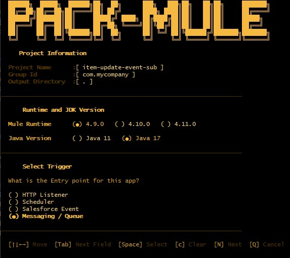
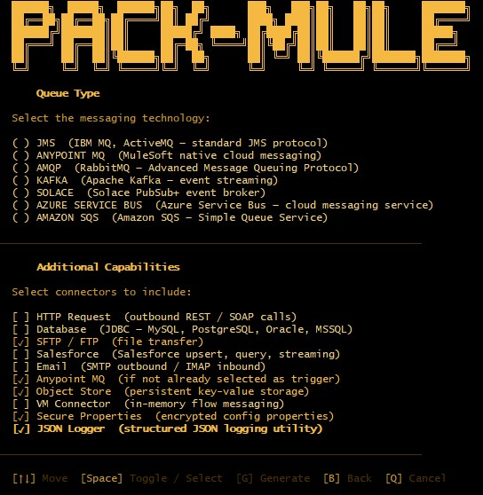

# Pack Mule — MuleSoft Project Initializer TUI

> A terminal user interface (TUI) for scaffolding MuleSoft Anypoint projects — inspired by Spring Initializr, powered by [TamboUI](https://tamboui.dev), and driven entirely by JMustache templates.

---

## Table of Contents

- [Overview](#overview)
- [Features](#features)
- [Architecture](#architecture)
- [Project Structure](#project-structure)
- [Configuration Reference](#configuration-reference)
- [Project Types & Auto-Dependencies](#project-types--auto-dependencies)
- [Adding Custom Templates](#adding-custom-templates)
- [Getting Started](#getting-started)
- [Building & Running](#building--running)
- [Roadmap](#roadmap)

---

## Overview

Pack Mule is a developer productivity tool that brings a fast, interactive project scaffolding experience to MuleSoft development. As an experienced MuleSoft developer, I built this tool to solve a problem I've encountered at every client and on every project — **enforcing coding standards is genuinely hard work**.

Every organisation has their own Mule coding standards, but getting developers to consistently follow them is a constant battle. The typical workarounds all have real limitations:

- **Maven Archetypes** — the go-to solution, but they're rigid. **You generate a single project type (HTTP-based *or* message queue-based), and that's it.** In reality, most Mule applications aren't that simple; a single app might need an HTTP listener, a message queue consumer, a database connection, and a scheduler all at once.
- **Copying an existing project** — developers grab a project that has the right standards baked in and **spend hours refactoring it to fit their current use case**, stripping out what they don't need and **hoping they don't break something in the process**.

Pack Mule solves this by letting you **select exactly the capabilities your project needs from the start**. Instead of manually copying boilerplate XML flows and hunting for connector dependency coordinates, you launch a TUI in your terminal, answer a few questions, toggle the modules you need, and get a **fully scaffolded, ready-to-import Anypoint Studio project in seconds** — with your organisation's standards already baked in.





All project files — `pom.xml`, Mule XML flows, `log4j2.xml`, and property placeholders — are generated from [JMustache](https://github.com/samskivert/jmustache) templates bundled inside the application. Generation is fast, fully offline, and requires no external tooling to scaffold.

---

## Features

- **Interactive TUI** — keyboard-driven navigation using TamboUI's Toolkit DSL; declarative, component-based screens with automatic focus management and CSS theming via TCSS files.
- **Spring Initializr-style capability selector** — toggle connectors and modules; the tool automatically injects the correct Maven dependency blocks into the generated `pom.xml`.
- **Pluggable project types** — RESTful API, Message Subscriber/Publisher, Batch/File Processing, Scheduled Jobs, and more.
- **Pure JMustache generation** — all output files are rendered from Mustache templates; no external `mvn archetype:generate` subprocess, no network calls, no Maven daemon required to scaffold.
- **Configurable via YAML** — a single `pack-mule.yml` controls runtime versions, dependency catalogs, and default values.
- **Separated template layer** — Mule XML flow templates live in their own module, completely decoupled from application logic.
- **GraalVM native image ready** — compile Pack Mule to a native binary for instant startup with no JVM warm-up.
- **Post-generation hooks** — run optional shell scripts or Java hooks after generation (e.g., `git init`, copy shared config files).

---

## Architecture


### Key Architectural Decisions

| Concern | Decision | Rationale |
|---|---|---|
| TUI framework | TamboUI (`tamboui-toolkit` + `tamboui-jline`) | Declarative DSL, TCSS theming, GraalVM native support |
| Template engine | JMustache | Logic-less, whitespace-friendly templates that do not conflict with Mule's native `${var}` syntax |
| Project scaffolding | `ProjectScaffolder` (pure Java) | Replaces Maven Archetype; in-process, offline, testable |
| Configuration | SnakeYAML | Human-friendly, no code changes needed to update connector versions |
| Dependency catalog | Declared in `pack-mule.yml` | Operators can add or version-bump connectors without touching Java |
| Distribution | Fat JAR + optional GraalVM native | Fat JAR for simplicity; native binary for CI/CD agent use |

---

### Generation Pipeline

```
User confirms on SummaryScreen
         │
         ▼
ProjectGenerator.generate(UserSelection)
         │
         ├─▶ DependencyResolver.resolve(capabilities)
         │         └─▶ returns List<Dependency> from pack-mule.yml catalog
         │
         │
         ├─▶ TemplateRenderer.render("base/pom.xml", model)
         │         └─▶ JMustache writes pom.xml with only selected <dependency> blocks
         │
         ├─▶ TemplateRenderer.render("triggers/{trigger}/*.xml", model)
         │         └─▶ JMustache writes Mule flow XML files
         │
         ├─▶ ProjectScaffolder.scaffold(spec, renderedFiles)
         │         └─▶ Creates target directory tree, evaluates template filenames as expressions
         │              to produce dynamically named files like customer-order-api-main.xml
         │
         └─▶ PostHookRunner.run(spec)
                   └─▶ Optional shell hooks (git init, etc.)
```


## Configuration Reference

[`pack-mule.yaml`](./src/main/resources/pack-mule.yaml) is the single control plane for all generation behavior.

---

## Project Types & Auto-Dependencies

When a developer selects a project type and toggles capabilities, `DependencyResolver` builds the full dependency list from `pack-mule.yml` and `TemplateRenderer` injects only the selected ones into `pom.xml` via a Mustache `{{#selectedDependencies}}` block — no manual copy-paste required.

| Project Type | Default Capabilities | Common Add-ons |
|---|---|---|
| **RESTful API** | HTTP Listener, APIkit, Error Handling | Database, Salesforce, Kafka |
| **Messaging** | Anypoint MQ, Error Handling | Kafka, Database |
| **Batch / File Processing** | File Connector, Batch Module, Error Handling | FTP, Salesforce, Database |
| **Scheduled Job** | Scheduler, Error Handling | Database, File Connector, HTTP |

---

## Adding Custom Templates

All output files are evaluated as JMustache templates inside the `templates/` module.
To add a new project capability or trigger:

1. Create a folder under `templates/src/main/resources/templates/capabilities/` (e.g., `WEBSOCKET/`).
2. Add `.xml` or `.yaml` files. Variables are evaluated using Mustache syntax: `{{variable}}`. The following variables are available in every template:

```
{{projectName}}               → "customer-order-api"
{{groupId}}                   → "com.acme"
{{muleVersion}}               → "4.6.0"
{{#selectedDependencies}}     → Used to iterate over injected dependencies
```

3. Register the new capability in `pack-mule.yml` under `capabilities`.
4. No Java changes required.

---

## Getting Started

### Prerequisites

- **Java 17+**
- **Apache Maven 3.8+** on `PATH` — needed to build and run the generated Mule project
- **MuleSoft Nexus credentials** (EE projects only) in `~/.m2/settings.xml`
- A terminal with ANSI support — macOS Terminal, iTerm2, Windows Terminal, any Linux terminal

### Install & Build

```bash
git clone https://github.com/josephgonzales01/pack-mule.git
cd pack-mule
mvn clean package -DskipTests
```

Produces a fat JAR at `target/pack-mule-app.jar`.

---

## Building & Running

```bash
# Interactive TUI
java -jar target/pack-mule-app.jar

# Use a custom config file
java -jar target/pack-mule-app.jar --config /path/to/pack-mule.yml
```

### Compile to Native Binary (GraalVM)

```bash
mvn -Pnative package
./target/pack-mule    # Zero JVM startup time
```

### Running Tests

```bash
mvn test                        # Unit tests
mvn verify -Pintegration-tests  # End-to-end generation tests
```
---

## Contributing

Pull requests are welcome. Please open an issue first to discuss changes. New capabilities should be accompanied by a FreeMarker template demonstrating their use, and dependency coordinates must be pinned to a specific version in `pack-mule.yml`.

> **Note:** TamboUI (`0.2.0-SNAPSHOT`) is under active development and its APIs may change between releases. If upgrading the BOM version causes compilation errors, check the [TamboUI changelog](https://github.com/tamboui/tamboui) and update affected screen classes.

---

## License

Apache License 2.0 — see [LICENSE](LICENSE) for details.
